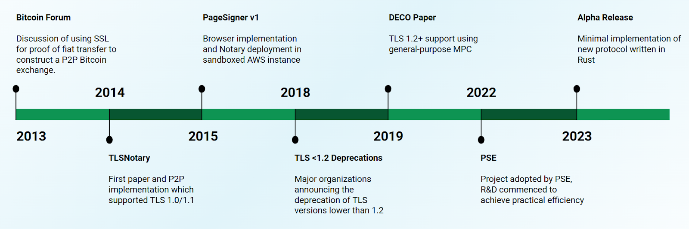
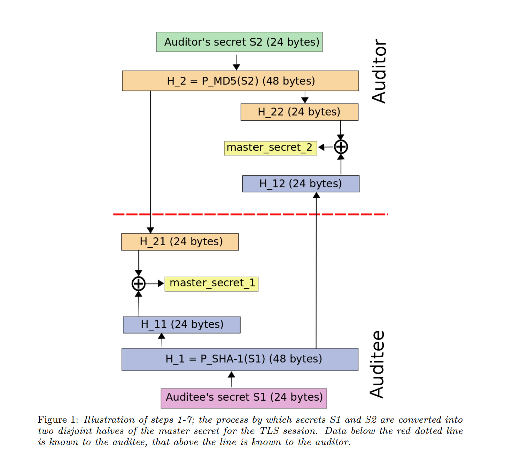
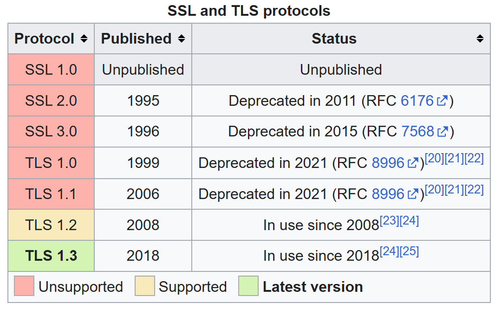
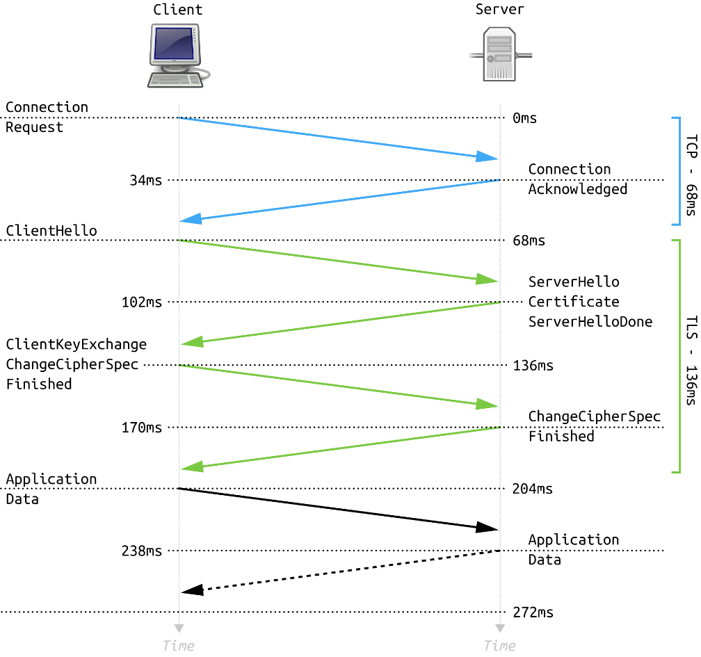
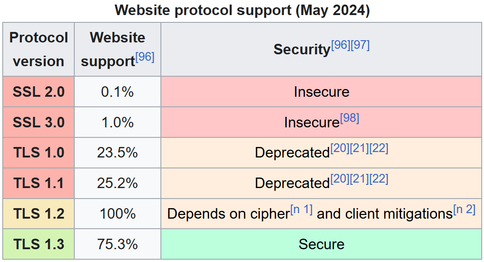
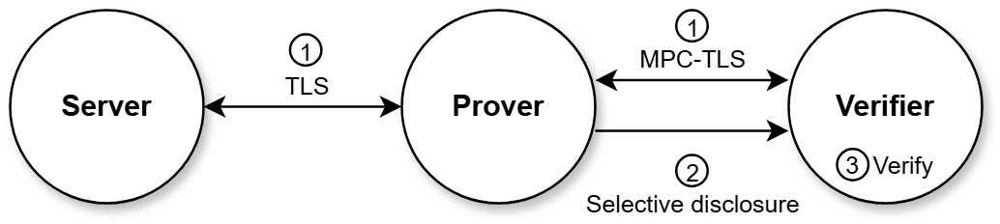
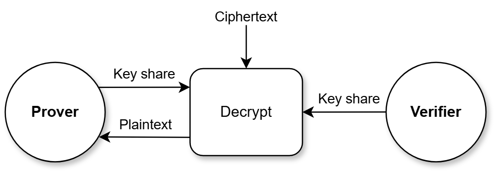

Ethereum just turned [10](https://ethereum.org/en/10years/). But before Ethereum, another protocol called TLSNotary was using cryptography to increase trust on the internet, to make the internet more peer-to-peer, censorship resistant, and verifiable.

In 2013, the internet was very different from today. Bitcoin was one of the most exciting and revolutionary ideas around. It wasn’t strictly a financial asset or “digital gold.” It was more open-ended. A potential gateway for other cryptographically enabled tools. This context formed the original motivation for TLSNotary, which was to build a mechanism to help free “Bitcoin from the harassment of the banks.” ([https://bitcointalk.org/index.php?topic=173220.0](https://bitcointalk.org/index.php?topic=173220.0))

TLSNotary aimed to do this by leveraging the same cryptographic protocol that secures the modern internet: TLS. It grew up alongside the web, working in parallel with the technology that powers most of today’s online activity.

<!-- truncate -->

# **Origin Story (2013 – 2015)**

To understand TLSNotary, we need a basic understanding of the protocol it works alongside. Transport Layer Security (TLS) ([https://en.wikipedia.org/wiki/Transport_Layer_Security](https://en.wikipedia.org/wiki/Transport_Layer_Security)) is a layer of the internet we use every day. You’re using it now to read this post. It’s the “S” in HTTPS and the little lock icon 🔒 you see in your browser.

TLS establishes a secure connection between you (the client) and the website (the server) you’re accessing. It’s an interactive connection most people never notice, yet it protects privacy and ensures the websites you visit are authentic. But TLS can’t sign the data it transmits. You can’t prove that a specific piece of data from a TLS session really came from the server.

So Dan Smith ([https://github.com/themighty1](https://github.com/themighty1)) came up with an idea and posted it on the Bitcoin Talk forum ([https://bitcointalk.org/index.php?topic=173220.0](https://bitcointalk.org/index.php?topic=173220.0)) in April 2013.

TLSNotary was a practical idea. At the time, it was hard to get bitcoins. Banks were hostile, and most people had to rely on centralized exchanges or custodial services like LocalBitcoins. There were no trustless, peer-to-peer methods available. And Ethereum didn’t exist yet.

But the internet already had a trustworthy cryptographic layer called SSL (the precursor to TLS). So the idea was simple: leverage the existing connection between client and server to create cryptographic proof of, for example, a bank transaction. If a user could generate a proof that money had been sent from one bank to another, that proof could be used to resolve disputes in a Bitcoin trade. Since the bank’s website already created a kind of receipt via SSL, why not take a cryptographic screenshot to prove the Bitcoin was paid for? People could exchange Bitcoin using these cryptographic proofs instead of relying on centralized platforms.

With that idea in place, the protocol began to evolve. New ideas  ([https://bitcointalk.org/index.php?topic=173220.msg2304618#msg2304618](https://bitcointalk.org/index.php?topic=173220.msg2304618#msg2304618))  were proposed, discussed, debated, and refined, until the concept had a name ([https://bitcointalk.org/index.php?topic=173220.msg4998488#msg4998488](https://bitcointalk.org/index.php?topic=173220.msg4998488#msg4998488)) and a working implementation. The alpha release ([https://bitcointalk.org/index.php?topic=173220.msg7143321#msg7143321](https://bitcointalk.org/index.php?topic=173220.msg7143321#msg7143321)) came in June 2014.

Dan Smith, Adam Gibson ([https://github.com/AdamISZ](https://github.com/AdamISZ)), and oakpacific ([https://github.com/oakpacific](https://github.com/oakpacific)) continued developing the original TLSNotary protocol ([https://github.com/tlsnotary/tlsnotary](https://github.com/tlsnotary/tlsnotary)). Then in September 2014, a whitepaper was released establishing the core idea of TLSNotary as a “mechanism for independently audited https sessions” ([https://tlsnotary.org/TLSNotary.pdf](https://tlsnotary.org/TLSNotary.pdf)).

[https://tlsnotary.org/TLSNotary.pdf](https://tlsnotary.org/TLSNotary.pdf)

The core idea has remained consistent across all versions of the protocol. When you visit a website, a secure TLS connection is established. The client and server generate secret keys and exchange data in a private session. During this session, an Auditor (now called a Verifier) partially participates. The Verifier never sees the full session key or the complete unencrypted data. Instead, they witness only a slice of the interaction—just enough to produce a cryptographic proof that someone else can verify.

A working version of TLSNotary was live almost a year before Ethereum mainnet was launched. A Chromium extension called PageSigner ([https://github.com/tlsnotary/pagesigner/](https://github.com/tlsnotary/pagesigner/)) implemented the protocol for everyday use.

Then it broke. The web migrated to TLS version 1.2 and the core mechanism TLSNotary relied on could no longer be used.

# **Breaking Changes and Rediscovery (2016-2021)**

The TLSNotary story is also a story about the general TLS protocol that secures our modern internet. So as SSL became TLS and TLS went from version 1.1 to 1.2, TLSNotary also had to become something different.

[https://en.wikipedia.org/wiki/Transport_Layer_Security](https://en.wikipedia.org/wiki/Transport_Layer_Security)

To understand why, you need to understand the two phases of the TLS protocol: the handshake and the record.

Every TLS connection begins with a handshake. During this phase, the client (browser) and server (website) agree on the rules of the connection. They negotiate a cipher suite – basically, the math game they’re going to play – and generate session-specific secrets. A back-and-forth process occurs where secrets are generated and shared that are only known to the server and client. These secrets are ephemeral or short-lived and won’t be used again. During this process, the server also provides certificates that prove its identity.

Once the handshake is complete, the connection is trusted and secure. Now comes the record phase: the part where encrypted data is actually exchanged between the client and server. This is when real communication happens, using the secrets just created. The record protocol ensures the encrypted data is authenticated, compressed (optionally), decrypted, and reconstructed into readable information. It’s an interactive process.

Simplified illustration of the full TLS 1.2 handshake with timing information. ([https://en.wikipedia.org/wiki/Transport_Layer_Security](https://en.wikipedia.org/wiki/Transport_Layer_Security))

TLSNotary’s original idea was to take the privacy, authentication, and reliability inside the TLS tunnel and bring it out into the world. The proof captures key session information like the domain name and ephemeral public key from the server, all traceable back to a trusted certificate.

But that relied on the original version of TLS.

The original TLSNotary depended on specific cryptographic functions like MD5 and SHA-1 in the pseudorandom function (PRF). These were replaced by SHA-256 in [TLS 1.2.](https://en.wikipedia.org/wiki/Transport_Layer_Security#TLS_1.2)

That broke the original TLSNotary. As websites migrated to newer versions of TLS, the original approach stopped working.

## **DECO**

Even after work on TLSNotary paused, interest in the problem it tried to solve continued.

In 2019, DECO ([https://arxiv.org/pdf/1909.00938](https://arxiv.org/pdf/1909.00938)) introduced a new approach for proving the origin of data in a TLS session. DECO focused on modern versions of TLS, specifically 1.2 and 1.3. Like TLSNotary, the idea was to enable users to access private data over secure TLS channels and then produce cryptographic proofs that the data came from a specific source. The DECO paper even referenced TLSNotary as a past effort that “only work with deprecated TLS versions and offer no privacy from the oracle (e.g., TLSNotary ) or rely on trusted hardware (e.g., Town Crier), against which various attacks have recently emerged.”

In DECO, we see the modern terminology for the two parties involved in the TLSNotary: Prover (formerly Auditee) and Verifier (formerly Auditor).

DECO also “introduces a novel three-party handshake protocol among the prover, verifier, and web server that creates an unforgeable commitment by the prover to the verifier on a piece of TLS session data.” This is the basic architecture we see in today’s version of TLSNotary.

[https://tlsnotary.org/about](https://tlsnotary.org/about)

But most importantly, DECO introduces the idea of secure multi-party computation (MPC) as a way for the Prover and Verifier to jointly participate in TLS sessions without compromising privacy.

# **The era of MPC and PSE (2022 to present day)**

The ideas introduced by DECO and projects like PADO (now Primus) ([https://primuslabs.xyz/](https://primuslabs.xyz/)) began to attract the attention of the [Privacy and Scaling Explorations](https://pse.dev/) team at the Ethereum Foundation ([https://ethereum.foundation/](https://ethereum.foundation/)). Specifically, former members Barry Whitehat ([https://github.com/barrywhitehat](https://github.com/barrywhitehat)) and Justin Martin([https://github.com/TheFrozenFire](https://github.com/TheFrozenFire)) were looking for a way to implement the ideas proposed in DECO.

Around the same time, Sinu ([https://github.com/sinui0](https://github.com/sinui0)) was looking for ways to securely and privately bring web2 data on to Ethereum. Seeing that TLSNotary was implementing DECO before DECO even existed, Sinu reached out to Dan, and together they applied for a PSE grant to revive TLSNotary using modern technology. The grant was accepted and the modern era of TLSNotary began.

The team began rebuilding TLSNotary ([https://tlsnotary.org/about](https://tlsnotary.org/about)) from the ground up in Rust and made the protocol compatible with TLS 1.2. But the biggest change was integrating MPC.

MPC ([https://en.wikipedia.org/wiki/Secure_multi-party_computation](https://en.wikipedia.org/wiki/Secure_multi-party_computation)) is a way for multiple parties to work together, to compute some mutual function without revealing their private data. It fits naturally with TLS, which is also interactive. Unlike zero-knowledge proofs, which are non-interactive, MPC can mirror the back-and-forth nature of a TLS session.

Since things (especially terminology) tend to change in a decade, let’s quickly recap the parties involved.

In TLS, there are two parties: Server (website) ⬄ Client (browser/ user)

In TLSNotary, there are two parties: Verifier (Auditor) ⬄ Prover (Auditee)

TLSNotary introduces a phase called MPC-TLS ([https://tlsnotary.org/docs/protocol/mpc-tls/](https://tlsnotary.org/docs/protocol/mpc-tls/)). During MPC-TLS, the Prover and Verifier look like a single client from the perspective of a TLS session server. From the perspective of TLSNotary, the Client is actually the Prover and Verifier performing MPC.

TLSNotary adds an actively involved Verifier to the process, but the Server has no idea.

[https://tlsnotary.org/about](https://tlsnotary.org/about)

During the handshake [https://tlsnotary.org/docs/protocol/mpc-tls/handshake](https://tlsnotary.org/docs/protocol/mpc-tls/handshake) the Prover and Verifier work together using MPC to compute and share the session keys. Neither party can see the full secret or forge messages on their own. But together, they create a provable and trustworthy record of the session.

During the TLS record phase, where application data is encrypted, exchanged, and decrypted, the Prover and Verifier are also performing MPC operations jointly. And just like in the handshake phase, the Verifier does not see the full set of data. The Verifier can only see what the Prover allows.

[https://tlsnotary.org/docs/protocol/mpc-tls/encryption](https://tlsnotary.org/docs/protocol/mpc-tls/encryption)

TLSNotary began as an idea that formed the roots of a modern ecosystem known as zkTLS. Although the ZK part is emphasized, it is a bit of a misnomer. Protocols like TLSNotary, which work in parallel to TLS, are inherently interactive. The ZK part is more the end product while the MPC part is where most of the work happens.

Still, zkTLS has stuck as a name, and it now describes a growing set of projects using TLS to prove the authenticity of web data. Some of these include:

- Opacity Network ([https://www.opacity.network/](https://www.opacity.network/))
- zkP2P ([https://www.zkp2p.xyz/](https://www.zkp2p.xyz/))
- vlayer ([https://www.vlayer.xyz/](https://www.vlayer.xyz/))
- Keyring ([https://keyring.network/](https://keyring.network/))
- Reclaim ([https://reclaimprotocol.org/](https://reclaimprotocol.org/))
- Primus ([https://primuslabs.xyz/](https://primuslabs.xyz/))
- And more.. ([https://tlsnotary.org/use-cases](https://tlsnotary.org/use-cases))

Many of these projects have been built with the actively maintained, free, and open-source library and protocol that is TLSNotary ([https://github.com/tlsnotary](https://github.com/tlsnotary)).

# **References**

TLSNotary Github

[https://github.com/tlsnotary](https://github.com/tlsnotary)

TLSNotary Website

[https://tlsnotary.org/](https://tlsnotary.org/)

Zero Knowledge Podcast with Sinu and Dan

[https://zeroknowledge.fm/podcast/368/](https://zeroknowledge.fm/podcast/368/)

TLSNotary Paper (2014)

[https://tlsnotary.org/TLSNotary.pdf](https://tlsnotary.org/TLSNotary.pdf)

Original Bitcoin Talk Post

[https://bitcointalk.org/index.php?topic=173220.0](https://bitcointalk.org/index.php?topic=173220.0)

DECO Paper

[https://arxiv.org/pdf/1909.00938](https://arxiv.org/pdf/1909.00938)

---

Google Drive Link: https://docs.google.com/document/d/1UH4I6SyJVBYBBWUIx2SXvDss_5khrnzo4xPNBT3-C1I/edit?usp=sharing
If needed for edits/ comments