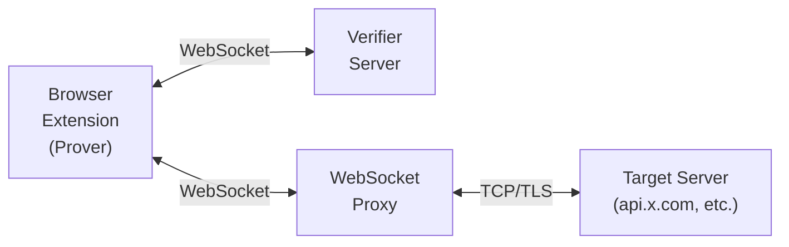

# TLSNotary Web Browser extension

## Overview

The browser is the natural interface for users to interact with their private web2 data. Users already authenticate through familiar login flows, and their sessions are maintained through cookies and authentication tokens. The TLSNotary browser extension leverages this existing authentication infrastructure to generate cryptographic proofs of application-specific requests — without requiring users to share credentials or re-authenticate.

The extension provides a secure development framework that balances flexibility with user protection. Developers write application-specific logic as JavaScript plugins that run in a sandboxed environment. This architecture enables rapid development while ensuring that sensitive authentication data never leaves the user's control. The sandbox isolates plugin code from credential access, preventing any possibility of data exfiltration.

## Architecture

The TLSNotary Web Extension consists of four core components that work together to generate cryptographic proofs of web data:

| Component                                                     | Role                                                                                                                                                 |
| ------------------------------------------------------------- | ---------------------------------------------------------------------------------------------------------------------------------------------------- |
| **[Browser Extension](#installation)**                        | Runs in the user's browser. Intercepts requests, executes plugins, and drives the MPC-TLS prover.                                                    |
| **[Plugin System](./plugins.md)**                             | JavaScript plugins that define *what* to prove — which site, which API call, and which fields to reveal.                                             |
| **[Verifier Server](./verifier.md)**                          | An independent server that participates in the MPC-TLS handshake, validates proofs, and optionally forwards results via webhooks.                    |
| **[WebSocket Proxy](./verifier.md#built-in-websocket-proxy)** | Browser extensions are not allowed to setup TCP connections with the target server, so the WebSocket Proxy bridges WebSocket connections to TCP/TLS. |



This architecture addresses three critical technical challenges:

### 1. Safe Header and Cookie Interception

Web applications rely on HTTP headers and cookies for authentication. The extension:

- Intercepts requests in a **sandboxed environment** before they leave the browser
- **Never sends credentials to external servers** — everything happens locally
- Uses Chrome's `webRequest` API to safely capture headers without exposing them
- Gives the user **full control** over exactly what to reveal in proofs

### 2. Isolated Plugin Execution

Plugins define *what* to prove (e.g. "prove my X.com username" or "prove my bank balance exceeds $10,000"). The extension provides a secure execution environment:

- **QuickJS WebAssembly sandbox** isolates plugin code from the browser process
- **No network access** — plugins cannot exfiltrate data
- **Limited API surface** — plugins only access designed capabilities (`prove()`, `openWindow()`, etc.)
- **User approval required** — plugins cannot execute without explicit consent

### 3. CORS-Compatible Architecture

Browsers enforce Same-Origin Policy and CORS, which prevents regular web pages from intercepting cross-origin requests. The extension runs with elevated permissions, allowing it to:

- Intercept any HTTPS request the browser makes
- Capture full request and response data (headers, body, etc.)
- Generate proofs for cross-origin API calls (X.com, GitHub, banks, etc.)

---

## Installation

### Chrome Web Store (Recommended)

1. Visit the [TLSNotary Extension on Chrome Web Store](https://chromewebstore.google.com/detail/gnoglgpcamodhflknhmafmjdahcejcgg)
2. Click **Add to Chrome**
3. Grant the required permissions

**Supported browsers:** Google Chrome, Microsoft Edge, Brave, and any Chromium-based browser.

### Build from Source

```bash
git clone https://github.com/tlsnotary/tlsn-extension.git
cd tlsn-extension
npm install
npm run build
```

Then load the extension in Chrome:

1. Open `chrome://extensions/`
2. Enable **Developer mode** (toggle in top right)
3. Click **Load unpacked**
4. Select the `packages/extension/build/` directory

For a production-optimized build:

```bash
NODE_ENV=production npm run build
```

---

## Getting Started

### Demo Site

The [demo site](https://demo.tlsnotary.org) provides pre-built plugins you can try immediately — no code required. It demonstrates end-to-end proof generation for popular services.

### Interactive Tutorial

The interactive tutorial walks you through the full development workflow:

1. **Concepts** — MPC-TLS, handlers, and selective disclosure
2. **Running Your First Plugin** — See a complete example in action (X.com proof)
3. **Writing Custom Handlers** — Add your own handler to prove bank balances
4. **Advanced Challenges** — Nested JSON paths, header revelation, request/response handling
5. **Breaking the Verifier** — Understand why proper verification logic matters

[**Start the Hosted Tutorial**](https://demo.tlsnotary.org/tutorial/) — The easiest way to get started, with a pre-configured verifier server.

**Run Locally:** Clone the [tutorial repository](https://github.com/tlsnotary/tlsn-extension/tree/main/packages/tutorial) and start a local verifier server (see [Verifier: Local Development](./verifier.md#local-development)). This gives you full control over the development environment.

---

## What's Next

- **[Plugin System](./plugins.md)** — Architecture, capabilities API, handler reference, and a full example plugin
- **[Verifier Server](./verifier.md)** — Deployment, API endpoints, webhook integration, and configuration
- **[Plugin SDK](https://github.com/tlsnotary/tlsn-extension/tree/main/packages/plugin-sdk)** — Source for `@tlsn/plugin-sdk`
- **[Report Issues](https://github.com/tlsnotary/tlsn-extension/issues)** — Bug reports and feature requests
